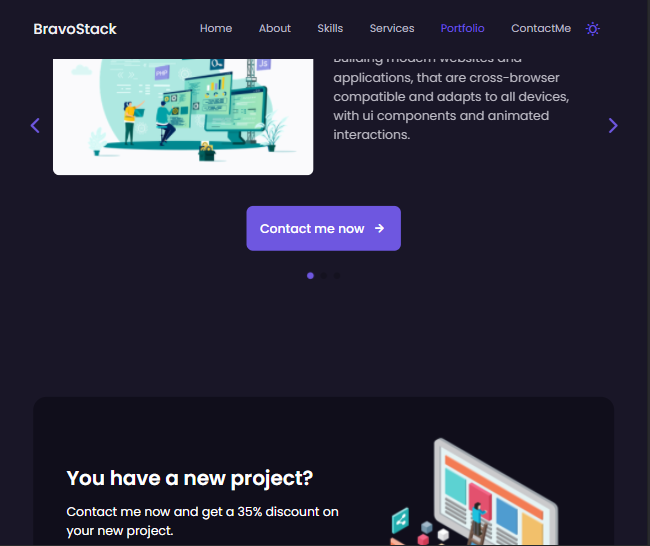

# Bravostack Portfolio
## This is a Responsive Web App, built using JS, CSS3 and HTML5
#### Design Inspiration from ` Bedimcode `
 
 

## Previews are provided below, 

### Smaller Device
#### Screen 1

#### Screen 2

 

 

### Medium Device

 

 

### Large Device 

 

 

### Larger Device
#### Screen 1

#### Screen 2

### Do follow me on twitter for more content on web development   [twitter.com/chukwuebukaonuh](https://twitter.com/ChukwuebukaOnuh)